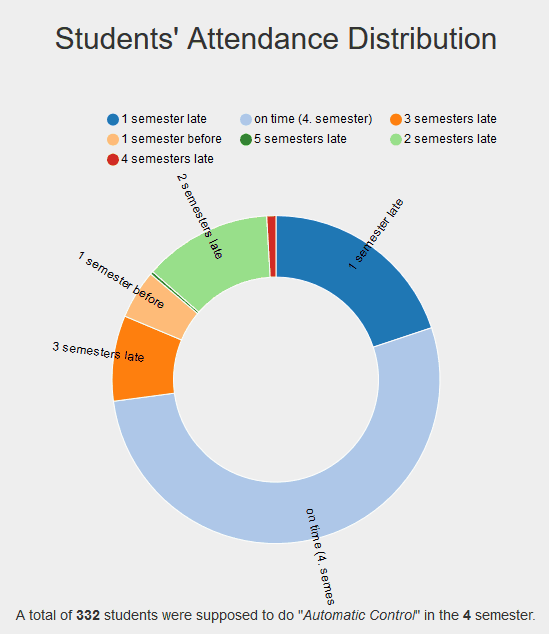

# University Analytics

*Web application to visualize university data using CakePHP and AngularJS.*

## Installation

In order to set up the web application, follow the steps below.

1. Set up your web server of choice
2. Copy the **athens2015** folder into the web server's www root (e.g. "htdocs/athens2015")
3. Configure the database connection in the **app/Config/database.php** file
4. Navigate to **http://localhost<:port>/athens2015/index.php/** in your web browser

***

This web application was an university project in the light of the [ATHENS programme](http://www.athensprogramme.com/), November Session 2015 at the [Instituto Superior Tecnico Lisboa](http://ai.tecnico.ulisboa.pt/en/programas-de-estudo/athens-in-cursos-de-curta-duracao/athens-in/).

